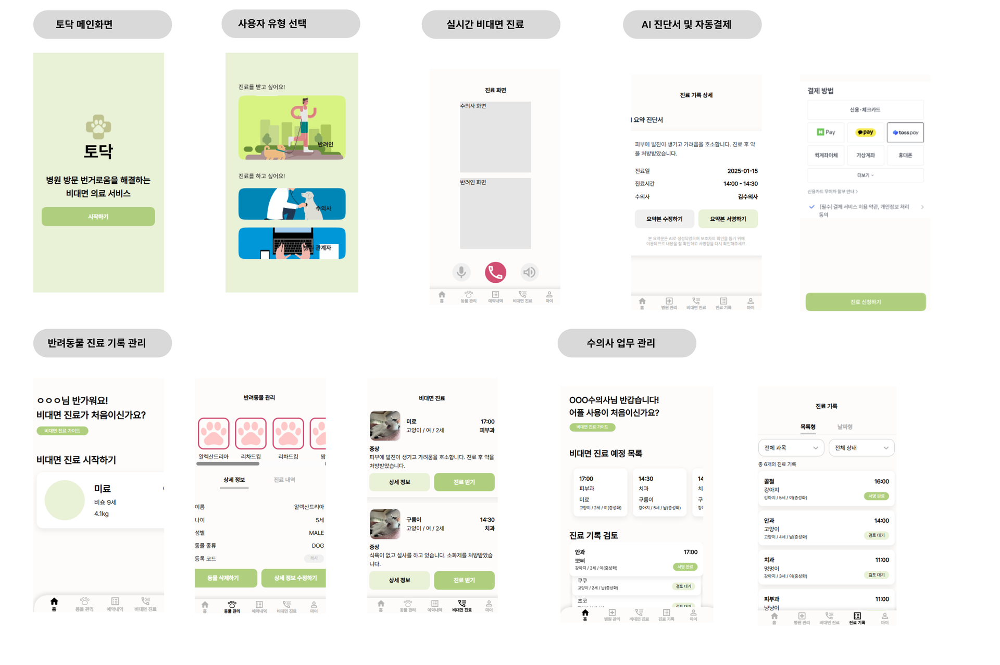

# 토닥
> 반려인의 병원 방문 번거로움을 해결하기 위한 비대면 의료 서비스

# ✅현재 진행상황
- [토닥](https://i13a409.p.ssafy.io/)
- [Swagger](http://i13a409.p.ssafy.io:8081/api/v1/swagger-ui/index.html#/)
- [팀 노션](https://www.notion.so/22c188d2e1888012a8ecfe2b19f1a7ea)


# 📜 목차
- [서비스 개요](#서비스-개요)
- [주요 기능](#주요-기능)
- [기술 스택](#-기술-스택)
- [아키텍처 구성](#아키텍처-구성)
- [폴더 구조](#폴더-구조)
- [팀원 소개](#팀원-소개)


# 📝서비스 개요
병원 방문이 어려운 바쁜 반려인들을 위한 반려동물 **비대면 의료 서비스**입니다.

###  페르소나
**구름이를 키우는 반려인 '이반려'**
 - **문제점** : 
    - 약물 투여시기 결정을 위해 병원에서 주기적인 관찰 진료가 필요
    - 병원에 대한 스트레스가 높음
- **필요한 점** :
    - 병원에 방문하지 않고 관찰 진료 필요
    - 시간, 공간에 제약 없이 진료 필요

### 서비스 화면


# 🪧주요 기능        

### 비대면 진료
- **비대면 진료** : RTC를 활용한 실시간 1:1 비대면 진료 
- **AI 요약** : 진료 종료 후 STT 파일을 AI가 요약하여 진단 내용 제공

### 회원 관리
- **로그인/회원가입** : 소셜 로그인, 역할별 부가정보 입력
- **마이페이지** : 회원 정보 조회, 수정, 로그아웃, 회원 탈퇴
- **병원 관리** : 병원 정보 조회, 수정

### 동물 관리
- **상세 정보** : 반려 동물별 정보 조회, 수정, 삭제
- **진료 내역** : 진료 완료된 내역 조회, 진료 과목/날짜별 필터링, AI요약(수의사 진단) 조회

### 예약 내역
- **예약 조회** : 반려 동물별 예약 내역을 상태별(대기/승인/반려)로 조회

### 수의사 관리
- 수의사별 기본 근무 시간 관리
- 수의사별 예약 가능 시간 관리
- 예약 신청 목록에서 승인 / 반려 선택

# 🛠기술 스텍

### Frontend
- Language: TypeScript
- Framework: React 18
- UI/스타일링: TailwindCSS
- 상태 관리: Zustand
- 라우팅: React Router Dom
- 개발 도구: Vit

### Backend

- Language: Java 17
- Framework: Spring Boot 3.3.3
- Database: MySQL, Redis, Elasticsearch
- ORM: Spring Data JPA
- 인증/보안: JWT (jjwt), Spring Security
- 메시징 서비스: RabbitMQ
- API 문서화: Swagger
- 웹소켓: Spring WebSocket
- 개발 도구: Lombok, Devtools
- AI : GMS

### Infra 
- Containerization: Docker
- CI/CD: Jenkins
- Cloud: AWS ,S3 Bucket

# 📐아키텍처 구성 
### 시스템 아키텍처


### ERD


# 📂폴더 구조
- Frontend
```
src/
 └── component/
     ├── button/
     │    ├── Button.tsx
     │    └── CopyButton.tsx
     ├── card/
     │    ├── OwnerTreatmentSimpleCard.tsx
     │    ├── PetProfileCard.tsx
     │    ├── RemoteTreatmentCard.tsx
     │    ├── SearchListItem.tsx
     │    ├── TreatmentRecordCard.tsx
     │    ├── TreatmentSlideCard.tsx
     │    └── TreatmentSlideList.tsx
     ├── header/
     │    ├── BackHeader.tsx
     │    └── SimpleHeader.tsx
     ├── icon/
     │    ├── AnimalIcon.tsx
     │    ├── Dropdown_Arrow.tsx
     │    ├── HomelIcon.tsx
     │    ├── HospitalIcon.tsx
     │    ├── kakao_login.png
     │    ├── MyPageIcon.tsx
     │    ├── PlusIcon.tsx
     │    ├── RecordIcon.tsx
     │    ├── ReservationIcon.tsx
     │    ├── ReservationManagementIcon.tsx
     │    ├── TreatmentIcon.tsx
     │    └── VetManagementIcon.tsx
     ├── menubar/
     │    ├── OwnerMenuBar.tsx
     │    ├── StaffMenuBar.tsx
     │    └── VetMenuBar.tsx
     ├── navbar/
     │    ├── TabGroupPet.tsx
     │    ├── TabGroupRoles.tsx
     │    ├── TabGroupTime.tsx
     │    ├── TabGroupTreatList.tsx
     │    └── TabGroupWaiting.tsx
     ├── pages/
     │    ├── Owner/
     │    │    ├── OwnerHome.tsx
     │    │    ├── OwnerHomeApplyForm.tsx
     │    │    ├── OwnerHomeSelectHospital.tsx
     │    │    ├── OwnerHomeSelectVet.tsx
     │    │    ├── OwnerHomeVetInfo.tsx
     │    │    ├── OwnerPetEdit.tsx
     │    │    ├── OwnerPetHome.tsx
     │    │    ├── OwnerPetRegister.tsx
     │    │    └── petMockList.ts
     │    ├── Reservation/
     │    │    ├── OwnerReservationDetail.tsx
     │    │    └── OwnerReservationHome.tsx
     │    └── Treatment/
     │         ├── OwnerTreatment.tsx
     │         ├── OwnerTreatmentDetail.tsx
     │         ├── OwnerMyPage.tsx
     │         └── OwnerTreatment.tsx
     ├── selection/
     │    ├── FilterDropdown.tsx
     │    ├── SelectionDropdown.tsx
     │    ├── TimeSelectionButton.tsx
     │    ├── TimeSelectionDropdown.tsx
     ├── state/
     │    ├── StatusBadge.tsx
     │    └── ReservationTimeTable.tsx
     ├── table/
     │    └── ReservationTimeTable.tsx
     ├── template/
     │    ├── AiSummaryForVet.tsx
     │    └── ModalTemplate.tsx
     ├── text/
     │    ├── ImageContent.tsx
     │    ├── MultipleContent.tsx
     │    ├── MultipleContentApi.tsx
     │    ├── SingleContent.tsx
     │    ├── SummaryContent.tsx
     │    └── TreatmentListContent.tsx
 ├── fonts/
 ├── layouts/
 ├── router/
 ├── RTC/
 ├── store/
 ├── styles/
 ├── App.css
 ├── App.tsx
 ├── index.css
 └── main.tsx
 ```
- Backend
```
backend/
├── build.gradle
├── docker-compose.yml
├── Dockerfile
├── gradlew
├── gradlew.bat
├── Jenkinsfile
├── settings.gradle
├── .gitattributes
├── .gitignore
│
├── src/
│   ├── main/
│   │   ├── java/com/A409/backend/
│   │   │   ├── BackendApplication.java
│   │   │   └── domain/
│   │   │       ├── home/
│   │   │       │   └── controller/
│   │   │       │       └── HomeController.java
│   │   │       │
│   │   │       ├── hospital/
│   │   │       │   ├── entity/
│   │   │       │   └── repository/
│   │   │       │
│   │   │       ├── pet/
│   │   │       │   └── entity/
│   │   │       │       ├── OwnerPet.java
│   │   │       │       └── Pet.java
│   │   │       │
│   │   │       ├── reservation/
│   │   │       │   └── entity/
│   │   │       │       ├── FirstTreatment.java
│   │   │       │       ├── Rejection.java
│   │   │       │       ├── Reservation.java
│   │   │       │       └── Treatment.java
│   │   │       │
│   │   │       ├── user/
│   │   │       │   ├── auth/
│   │   │       │   │   ├── entity/
│   │   │       │   │   │   └── Auth.java
│   │   │       │   │   └── repository/
│   │   │       │   │       └── AuthRepository.java
│   │   │       │   │
│   │   │       │   ├── owner/
│   │   │       │   │   ├── controller/
│   │   │       │   │   ├── dto/
│   │   │       │   │   ├── entity/
│   │   │       │   │   ├── repository/
│   │   │       │   │   └── service/
│   │   │       │   │
│   │   │       │   ├── staff/
│   │   │       │   │   ├── controller/
│   │   │       │   │   ├── dto/
│   │   │       │   │   ├── entity/
│   │   │       │   │   ├── repository/
│   │   │       │   │   └── service/
│   │   │       │   │
│   │   │       │   └── vet/
│   │   │       │       ├── controller/
│   │   │       │       ├── dto/
│   │   │       │       ├── entity/
│   │   │       │       ├── repository/
│   │   │       │       └── service/
│   │   │       │
│   │   │       └── global/
│   │   │
│   │   └── resources/
│   │       ├── elasticsearch/
│   │       └── application.properties
│   │
│   └── test/
```

# 👥팀원 소개
| 이대연 | 김유성 | 송인범 | 안성수 | 전윤지 | 한진경 |
|-------------|--------|--------|--------|--------|--------|
| FE, 팀장         | BE     | BE     | BE     | FE     | FE     |


