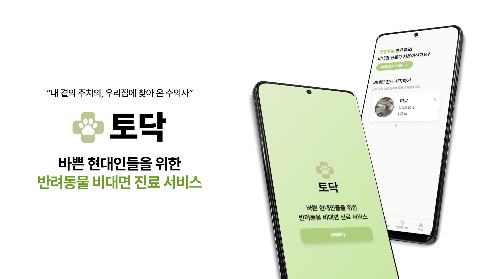
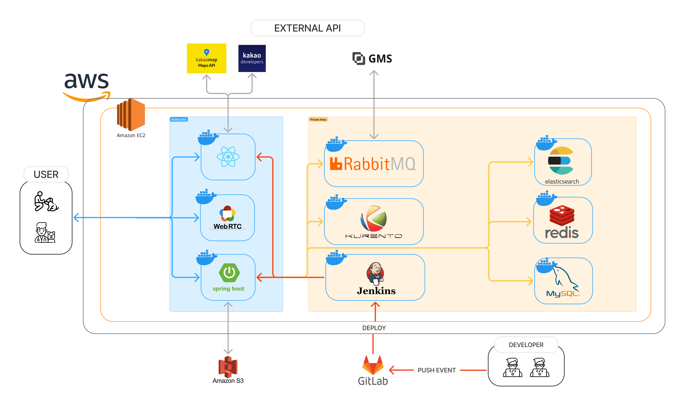
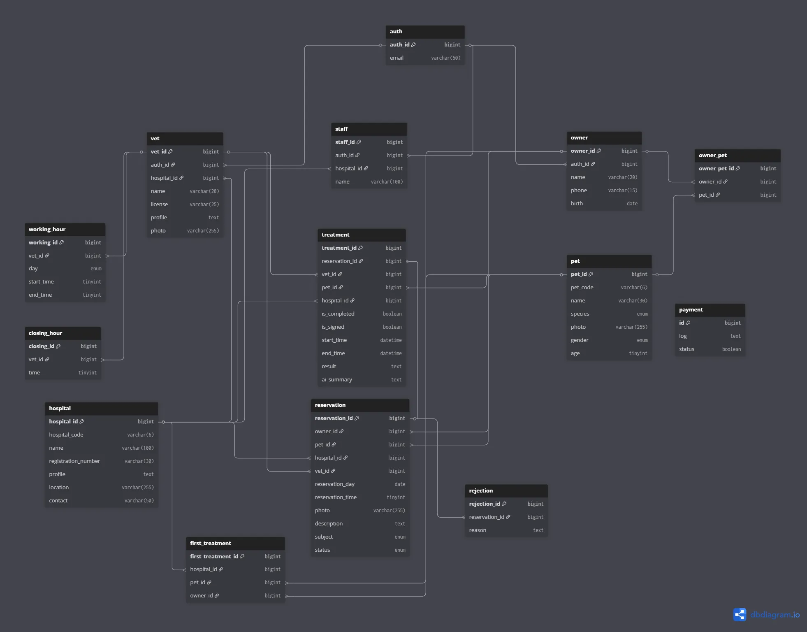

# 토닥
> 반려인의 병원 방문 번거로움을 해결하기 위한 비대면 의료 서비스



# 📜 목차
- [서비스 개요](#서비스-개요)
- [주요 기능](#주요-기능)
- [기술 스택](#기술-스택)
- [아키텍처 구성](#아키텍처-구성)
- [폴더 구조](#폴더-구조)
- [팀원 소개](#팀원-소개)


# 📝서비스 개요
병원 방문이 어려운 바쁜 반려인들을 위한 반려동물 **비대면 의료 서비스**입니다.

###  페르소나
**구름이를 키우는 반려인 '이반려'**
 - **문제점** : 
    - 약물 투여시기 결정을 위해 병원에서 주기적인 관찰 진료가 필요
    - 병원에 대한 스트레스가 높음
- **필요한 점** :
    - 병원에 방문하지 않고 관찰 진료 필요
    - 시간, 공간에 제약 없이 진료 필요

# ⚡주요 기능
> 토닥은 반려인, 수의사 , 병원 관계자 3가지의 사용자 유형이 존재
<div class=flex>


</div>


## 1. 반려인
### 반려동물 관리
- **프로필 등록** : 반려동물의 정보를 프로필 형태로 등록하여 정보 열람 및 관리
<div class = "flex">


</div>

  
### 진료 내역 조회
- **예약 요약 제공** : 작성했던 진료 신청서 내용을 요약해 어떤 진료 내역인지 한눈에 확인 가능
- **AI 요약 진단서** : 수의사의 검증을 거친 AI 요약 진단서 보관


### 예약 신청
- **신청서 작성** : 원하는 병원과 수의사를 검색 후 선택하고, 증상 입력
- **자동 결제 수단 선택** : 카카오페이 결제를 통해 예약을 확정하고 승인 대기 상태로 전환
<div class = "flex">


</div>

## 2. 수의사
### 비대면 진료
- **실시간 1:1진료** : Kurento 기반 WebRTC 기술을 활용하여 원격 화상 진료 지원
<div class = "flex">


</div>


### 진단서 검토
- **STT → text 변환** : Whisper-1을 이용해 비대면 진료 중 음성을 텍스트 파일로 변환
- **AI text 요약** : 의료 용어가 많은 텍스트를 ChatGPT 4.1을 통해 핵심 내용 요약
- **수의사 검증** : 수의사의 검토 절차를 통해 수정, 승인


## 3. 병원 관계자
### 진료 일정 관리
- **예약 시간 설정** : 버튼 토클 방식으로 진료 가능/불가 시간 설정
<div class = "flex">


</div>

### 예약 관리
- **신청 목록 확인** : 전체 예약 내역을 조회하고, 내용을 검토한 뒤 승인 또는 반려 처리 가능


### 원무
- **수납** : 진료 종료 후 결제 금액 입력 → 자동 결제 요청


# 🛠기술 스택

### Frontend
- Language: TypeScript
- Framework: React 19
- UI/스타일링: TailwindCSS
- 상태 관리: Zustand
- 라우팅: React Router Dom
- 개발 도구: Vit

### Backend

- Language: Java 17
- Framework: Spring Boot 3.3.3
- Database: MySQL, Redis, Elasticsearch
- ORM: Spring Data JPA
- 인증/보안: JWT (jjwt), Spring Security
- 메시징 서비스: RabbitMQ
- API 문서화: Swagger
- 웹소켓: Spring WebSocket
- 개발 도구: Lombok, Devtools
- AI : GMS

### Infra 
- Containerization: Docker
- CI/CD: Jenkins
- Cloud: AWS ,S3 Bucket

# 📐아키텍처 구성 
### 시스템 아키텍처


### ERD


# 📂폴더 구조
- Frontend
```
Todak/
├── frontend/                 # React 기반 프론트엔드
│   ├── src/                  # 소스코드
│   │   ├── component/        # 공통/페이지별 컴포넌트
│   │   │   │   ├── auth/     # 인증 관련 페이지
│   │   │   │   ├── Owner/    # 반려인 페이지
│   │   │   │   ├── Staff/    # 직원 페이지
│   │   │   │   ├── Vet/      # 수의사 페이지
│   │   ├── assets/           # 이미지, 폰트 등 정적 리소스
│   │   ├── types/            # TypeScript 타입 정의
│   │   │   ├── Owner/        # 반려동물 주인 관련 타입
│   │   │   ├── Staff/        # 직원 관련 타입
│   │   │   ├── Vet/          # 수의사 관련 타입
│   │   │   └── auth.ts       # 인증 관련 타입
│   │   ├── services/         # API 서비스 로직
│   │   │   └── api/          # API 호출 함수들
│   │   ├── router/           # 라우팅 설정
│   │   ├── layouts/          # 레이아웃 컴포넌트
│   │   ├── store/            # 상태 관리 (Zustand)
│   │   ├── RTC/              # 실시간 통신 (WebRTC)
│   │   ├── utils/            # 유틸리티 함수
│   │   ├── styles/           # CSS 스타일
│   │   ├── plugins/          # 플러그인 설정 (axios 등)
│   │   └── ...               # 기타 src 하위 파일
│   ├── public/               # 정적 파일 (이미지, favicon 등)
│   ├── dist/                 # 빌드된 파일들
│   ├── package.json          # 프론트엔드 의존성/스크립트
│   ├── vite.config.ts        # Vite 설정
│   ├── tailwind.config.js    # Tailwind CSS 설정
│   ├── Dockerfile            # 프론트엔드 도커파일
│   ├── Jenkinsfile           # CI/CD 파이프라인 설정
│   ├── nginx.conf            # Nginx 설정
│   └── ...                   # 기타 설정 파일 (tsconfig, eslint 등)
│
├── README.md                 # 프로젝트 설명서
└── ...                       # 기타 파일/폴더
 ```
- Backend
```
backend/
├── build.gradle
├── docker-compose.yml
├── Dockerfile
├── gradlew
├── gradlew.bat
├── Jenkinsfile
├── settings.gradle
├── .gitattributes
├── .gitignore
│
├── src/
│   ├── main/
│   │   ├── java/com/A409/backend/
│   │   │   ├── BackendApplication.java
│   │   │   └── domain/
│   │   │       ├── home/
│   │   │       │   └── controller/
│   │   │       │       └── HomeController.java
│   │   │       │
│   │   │       ├── hospital/
│   │   │       │   ├── entity/
│   │   │       │   └── repository/
│   │   │       │
│   │   │       ├── pet/
│   │   │       │   └── entity/
│   │   │       │       ├── OwnerPet.java
│   │   │       │       └── Pet.java
│   │   │       │
│   │   │       ├── reservation/
│   │   │       │   └── entity/
│   │   │       │       ├── FirstTreatment.java
│   │   │       │       ├── Rejection.java
│   │   │       │       ├── Reservation.java
│   │   │       │       └── Treatment.java
│   │   │       │
│   │   │       ├── user/
│   │   │       │   ├── auth/
│   │   │       │   │   ├── entity/
│   │   │       │   │   │   └── Auth.java
│   │   │       │   │   └── repository/
│   │   │       │   │       └── AuthRepository.java
│   │   │       │   │
│   │   │       │   ├── owner/
│   │   │       │   │   ├── controller/
│   │   │       │   │   ├── dto/
│   │   │       │   │   ├── entity/
│   │   │       │   │   ├── repository/
│   │   │       │   │   └── service/
│   │   │       │   │
│   │   │       │   ├── staff/
│   │   │       │   │   ├── controller/
│   │   │       │   │   ├── dto/
│   │   │       │   │   ├── entity/
│   │   │       │   │   ├── repository/
│   │   │       │   │   └── service/
│   │   │       │   │
│   │   │       │   └── vet/
│   │   │       │       ├── controller/
│   │   │       │       ├── dto/
│   │   │       │       ├── entity/
│   │   │       │       ├── repository/
│   │   │       │       └── service/
│   │   │       │
│   │   │       └── global/
│   │   │
│   │   └── resources/
│   │       ├── elasticsearch/
│   │       └── application.properties
│   │
│   └── test/
```

# 👥팀원 소개
| 이대연 | 김유성 | 송인범 | 안성수 | 전윤지 | 한진경 |
|-------------|--------|--------|--------|--------|--------|
| FE, 팀장         | BE     | BE     | BE     | FE     | FE     |


