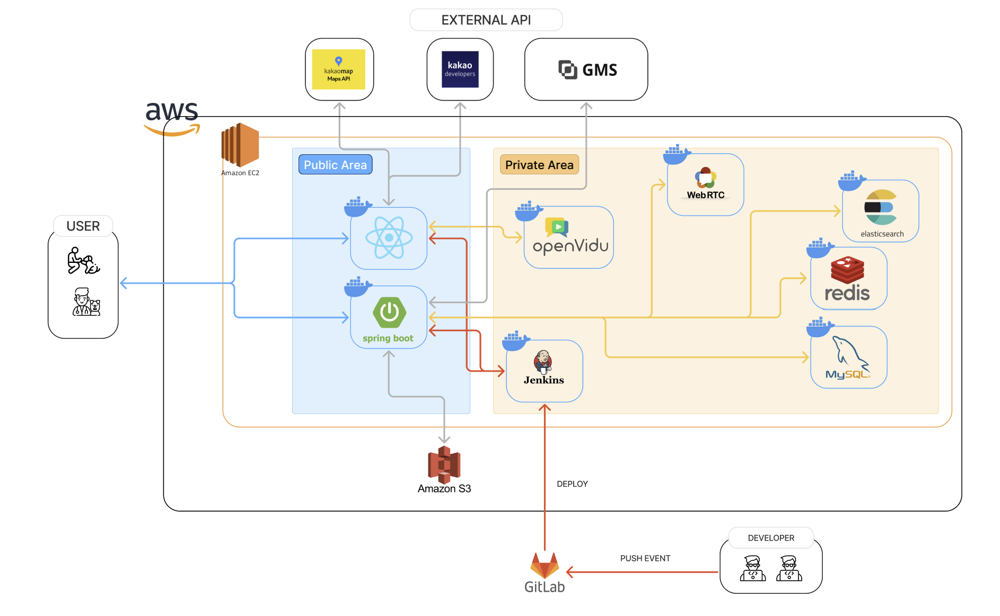

# 토닥
> 반려인의 병원 방문 번거로움을 해결하기 위한 비대면 의료 서비스

# 📝서비스 개요
병원 방문이 어려운 바쁜 반려인들을 위한  반려견 비대면 의료 서비스입니다.

###  페르소나
**구름이를 키우는 반려인 '이반려'**
 - **문제점** : 
    - 약물 투여시기 결정을 위해 병원에서 주기적인 관찰 진료가 필요
    - 병원에 대한 스트레스가 높음
- **필요한 점** :
    - 병원에 방문하지 않고 관찰 진료 필요
    - 시간, 공간에 제약 없이 진료 필요

# 🪧주요 기능 설명          

### 비대면 진료
- **비대면 진료** : RTC를 활용한 실시간 1:1 비대면 진료 
- **AI 요약** : 진료 종료 후 STT 파일을 AI가 요약하여 진단 내용 제공

### 회원 관리
- **로그인/회원가입** : 소셜 로그인, 역할별 부가정보 입력
- **마이페이지** : 회원 정보 조회, 수정, 로그아웃, 회원 탈퇴
- **병원 관리** : 병원 정보 조회, 수정

### 동물 관리
- **상세 정보** : 반려 동물별 정보 조회, 수정, 삭제
- **진료 내역** : 진료 완료된 내역 조회, 진료 과목/날짜별 필터링, AI요약(수의사 진단) 조회

### 예약 내역
- **예약 조회** : 반려 동물별 예약 내역을 상태별(대기/승인/반려)로 조회

### 수의사 관리
- 수의사별 기본 근무 시간 관리
- 수의사별 예약 가능 시간 관리
- 예약 신청 목록에서 승인 / 반려 선택

# 🛠 기술 스텍

### Frontend
- Language: TypeScript
- Framework: React 18
- UI/스타일링: TailwindCSS
- 상태 관리: Zustand
- 라우팅: React Router Dom
- 개발 도구: Vit

### ERD

### 시스템 아키텍처

